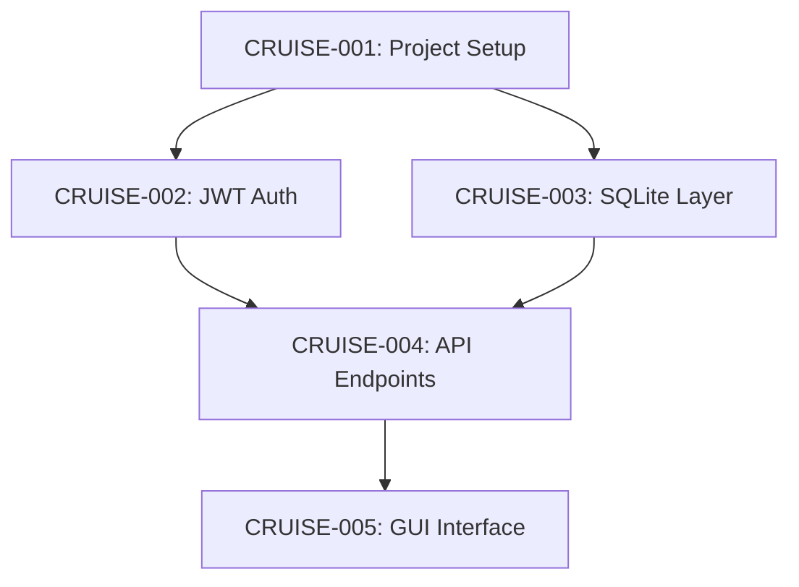

# Cruise-Control Implementation Plan

> **For Claude:** REQUIRED SUB-SKILL: Use superpowers:executing-plans to implement this plan task-by-task.

**Goal:** Build an autonomous development orchestrator that plans, builds, and validates applications using spawn-team coordination.

**Architecture:** Three-phase workflow (Plan → Build → Validate) with GitHub PR approval gates, dependency-aware parallel execution, and comprehensive audit reporting. Beads issues serve as source of truth, markdown as derived human view.

**Tech Stack:** Rust, tokio async, gh CLI for GitHub operations, serde for config, existing spawn-team infrastructure.

**Design Document:** `docs/plans/2026-02-01-cruise-control-design.md`

---

## Phase 1: Core Types and Configuration

### Task 1.1: Add Cruise Error Variants

**Files:**
- Modify: `core/src/error.rs`

**Step 1: Add cruise-specific error variants**

```rust
// Add to Error enum in core/src/error.rs

    /// Cruise-control operation failed.
    #[error("cruise-control error: {0}")]
    Cruise(String),

    /// GitHub API operation failed.
    #[error("GitHub operation failed: {0}")]
    GitHub(String),

    /// Plan approval timeout.
    #[error("plan approval timed out after {0} seconds")]
    ApprovalTimeout(u64),

    /// Dependency cycle detected in plan.
    #[error("dependency cycle detected: {0}")]
    DependencyCycle(String),
```

**Step 2: Run existing tests to verify no regression**

Run: `cd core && cargo test`
Expected: All 120 tests pass

**Step 3: Commit**

```bash
git add core/src/error.rs
git commit -m "feat(cruise): add cruise-control error variants"
```

---

### Task 1.2: Create Cruise Config Types

**Files:**
- Create: `core/src/cruise/mod.rs`
- Create: `core/src/cruise/config.rs`
- Modify: `core/src/lib.rs`

**Step 1: Write failing test for CruiseConfig**

Create `core/src/cruise/config.rs`:

```rust
//! Configuration for cruise-control operations.

use std::time::Duration;
use serde::{Deserialize, Serialize};

/// PR strategy for task completion.
#[derive(Debug, Clone, Copy, PartialEq, Eq, Default, Serialize, Deserialize)]
#[serde(rename_all = "kebab-case")]
pub enum PrStrategy {
    /// One PR per task.
    #[default]
    PerTask,
    /// Group related tasks into batched PRs.
    Batch,
    /// Single accumulating PR with commits per task.
    Single,
}

/// Test repository lifecycle.
#[derive(Debug, Clone, Copy, PartialEq, Eq, Default, Serialize, Deserialize)]
#[serde(rename_all = "lowercase")]
pub enum RepoLifecycle {
    /// Delete repository after test completion.
    #[default]
    Ephemeral,
    /// Keep repository but reset between runs.
    Persistent,
    /// Keep all artifacts, create new repos per run.
    Accumulating,
}

/// Test success criteria level.
#[derive(Debug, Clone, Copy, PartialEq, Eq, Default, Serialize, Deserialize)]
#[serde(rename_all = "lowercase")]
pub enum TestLevel {
    /// All phases complete.
    Basic,
    /// All phases complete AND app passes tests.
    #[default]
    Functional,
    /// All phases, app works, AND no critical audit findings.
    Strict,
}

/// Configuration for the planning phase.
#[derive(Debug, Clone, Serialize, Deserialize)]
pub struct PlanningConfig {
    /// Max ping-pong iterations.
    #[serde(default = "default_ping_pong_iterations")]
    pub ping_pong_iterations: u32,
    /// Reviewer LLM identifier.
    #[serde(default = "default_reviewer_llm")]
    pub reviewer_llm: String,
}

fn default_ping_pong_iterations() -> u32 {
    5
}

fn default_reviewer_llm() -> String {
    "gemini-cli".to_string()
}

impl Default for PlanningConfig {
    fn default() -> Self {
        Self {
            ping_pong_iterations: default_ping_pong_iterations(),
            reviewer_llm: default_reviewer_llm(),
        }
    }
}

/// Configuration for the build phase.
#[derive(Debug, Clone, Serialize, Deserialize)]
pub struct BuildingConfig {
    /// Maximum parallel spawn-team instances.
    #[serde(default = "default_max_parallel")]
    pub max_parallel: usize,
    /// PR creation strategy.
    #[serde(default)]
    pub pr_strategy: PrStrategy,
    /// Reviewer LLM for sequential mode.
    #[serde(default = "default_reviewer_llm")]
    pub sequential_reviewer: String,
}

fn default_max_parallel() -> usize {
    3
}

impl Default for BuildingConfig {
    fn default() -> Self {
        Self {
            max_parallel: default_max_parallel(),
            pr_strategy: PrStrategy::default(),
            sequential_reviewer: default_reviewer_llm(),
        }
    }
}

/// Configuration for the validation phase.
#[derive(Debug, Clone, Serialize, Deserialize)]
pub struct ValidationConfig {
    /// Test success level.
    #[serde(default)]
    pub test_level: TestLevel,
    /// Curl timeout in seconds.
    #[serde(default = "default_curl_timeout")]
    pub curl_timeout: u64,
}

fn default_curl_timeout() -> u64 {
    30
}

impl Default for ValidationConfig {
    fn default() -> Self {
        Self {
            test_level: TestLevel::default(),
            curl_timeout: default_curl_timeout(),
        }
    }
}

/// Configuration for PR approval polling.
#[derive(Debug, Clone, Serialize, Deserialize)]
pub struct ApprovalConfig {
    /// Initial poll interval.
    #[serde(default = "default_poll_initial")]
    pub poll_initial: Duration,
    /// Maximum poll interval.
    #[serde(default = "default_poll_max")]
    pub poll_max: Duration,
    /// Exponential backoff multiplier.
    #[serde(default = "default_poll_backoff")]
    pub poll_backoff: f64,
}

fn default_poll_initial() -> Duration {
    Duration::from_secs(60)
}

fn default_poll_max() -> Duration {
    Duration::from_secs(1800)
}

fn default_poll_backoff() -> f64 {
    2.0
}

impl Default for ApprovalConfig {
    fn default() -> Self {
        Self {
            poll_initial: default_poll_initial(),
            poll_max: default_poll_max(),
            poll_backoff: default_poll_backoff(),
        }
    }
}

/// Configuration for E2E testing.
#[derive(Debug, Clone, Serialize, Deserialize)]
pub struct TestConfig {
    /// Default GitHub organization.
    #[serde(default = "default_org")]
    pub default_org: String,
    /// Repository lifecycle.
    #[serde(default)]
    pub repo_lifecycle: RepoLifecycle,
}

fn default_org() -> String {
    "epiphytic".to_string()
}

impl Default for TestConfig {
    fn default() -> Self {
        Self {
            default_org: default_org(),
            repo_lifecycle: RepoLifecycle::default(),
        }
    }
}

/// Top-level cruise-control configuration.
#[derive(Debug, Clone, Default, Serialize, Deserialize)]
pub struct CruiseConfig {
    /// Planning phase configuration.
    #[serde(default)]
    pub planning: PlanningConfig,
    /// Building phase configuration.
    #[serde(default)]
    pub building: BuildingConfig,
    /// Validation phase configuration.
    #[serde(default)]
    pub validation: ValidationConfig,
    /// Approval polling configuration.
    #[serde(default)]
    pub approval: ApprovalConfig,
    /// E2E test configuration.
    #[serde(default)]
    pub test: TestConfig,
}

#[cfg(test)]
mod tests {
    use super::*;

    #[test]
    fn cruise_config_has_sensible_defaults() {
        let config = CruiseConfig::default();

        assert_eq!(config.planning.ping_pong_iterations, 5);
        assert_eq!(config.planning.reviewer_llm, "gemini-cli");
        assert_eq!(config.building.max_parallel, 3);
        assert_eq!(config.building.pr_strategy, PrStrategy::PerTask);
        assert_eq!(config.validation.test_level, TestLevel::Functional);
        assert_eq!(config.approval.poll_initial, Duration::from_secs(60));
        assert_eq!(config.test.default_org, "epiphytic");
    }

    #[test]
    fn pr_strategy_serializes_correctly() {
        assert_eq!(
            serde_json::to_string(&PrStrategy::PerTask).unwrap(),
            "\"per-task\""
        );
        assert_eq!(
            serde_json::to_string(&PrStrategy::Batch).unwrap(),
            "\"batch\""
        );
        assert_eq!(
            serde_json::to_string(&PrStrategy::Single).unwrap(),
            "\"single\""
        );
    }

    #[test]
    fn repo_lifecycle_serializes_correctly() {
        assert_eq!(
            serde_json::to_string(&RepoLifecycle::Ephemeral).unwrap(),
            "\"ephemeral\""
        );
        assert_eq!(
            serde_json::to_string(&RepoLifecycle::Persistent).unwrap(),
            "\"persistent\""
        );
    }

    #[test]
    fn test_level_serializes_correctly() {
        assert_eq!(
            serde_json::to_string(&TestLevel::Basic).unwrap(),
            "\"basic\""
        );
        assert_eq!(
            serde_json::to_string(&TestLevel::Functional).unwrap(),
            "\"functional\""
        );
        assert_eq!(
            serde_json::to_string(&TestLevel::Strict).unwrap(),
            "\"strict\""
        );
    }

    #[test]
    fn cruise_config_deserializes_from_toml() {
        let toml = r#"
            [planning]
            ping_pong_iterations = 3
            reviewer_llm = "claude-code"

            [building]
            max_parallel = 5
            pr_strategy = "batch"

            [validation]
            test_level = "strict"
        "#;

        let config: CruiseConfig = toml::from_str(toml).unwrap();
        assert_eq!(config.planning.ping_pong_iterations, 3);
        assert_eq!(config.planning.reviewer_llm, "claude-code");
        assert_eq!(config.building.max_parallel, 5);
        assert_eq!(config.building.pr_strategy, PrStrategy::Batch);
        assert_eq!(config.validation.test_level, TestLevel::Strict);
    }
}
```

**Step 2: Create module file**

Create `core/src/cruise/mod.rs`:

```rust
//! Cruise-control: autonomous development orchestrator.
//!
//! Three-phase workflow: Plan → Build → Validate

pub mod config;

pub use config::{
    ApprovalConfig, BuildingConfig, CruiseConfig, PlanningConfig,
    PrStrategy, RepoLifecycle, TestConfig, TestLevel, ValidationConfig,
};
```

**Step 3: Add cruise module to lib.rs**

Add to `core/src/lib.rs`:

```rust
pub mod cruise;
```

And add exports:

```rust
pub use cruise::{
    ApprovalConfig, BuildingConfig, CruiseConfig, PlanningConfig,
    PrStrategy, RepoLifecycle, TestConfig, TestLevel, ValidationConfig,
};
```

**Step 4: Run tests to verify**

Run: `cd core && cargo test cruise::`
Expected: 5 tests pass

**Step 5: Commit**

```bash
git add core/src/cruise/ core/src/lib.rs
git commit -m "feat(cruise): add cruise-control configuration types"
```

---

### Task 1.3: Create Cruise Task Types

**Files:**
- Create: `core/src/cruise/task.rs`
- Modify: `core/src/cruise/mod.rs`

**Step 1: Write failing test for CruiseTask**

Create `core/src/cruise/task.rs`:

```rust
//! Task representation for cruise-control plans.

use std::collections::HashSet;
use serde::{Deserialize, Serialize};

/// Status of a cruise task.
#[derive(Debug, Clone, Copy, PartialEq, Eq, Default, Serialize, Deserialize)]
#[serde(rename_all = "lowercase")]
pub enum TaskStatus {
    /// Task is waiting to be started.
    #[default]
    Pending,
    /// Task is currently being executed.
    InProgress,
    /// Task completed successfully.
    Completed,
    /// Task failed and is blocked.
    Blocked,
    /// Task was skipped.
    Skipped,
}

/// Complexity estimate for a task.
#[derive(Debug, Clone, Copy, PartialEq, Eq, Default, Serialize, Deserialize)]
#[serde(rename_all = "lowercase")]
pub enum TaskComplexity {
    /// Simple task (< 30 min).
    Low,
    /// Moderate task (30-60 min).
    #[default]
    Medium,
    /// Complex task (> 60 min).
    High,
}

/// A single task in a cruise-control plan.
#[derive(Debug, Clone, Serialize, Deserialize)]
pub struct CruiseTask {
    /// Unique task identifier (e.g., "CRUISE-001").
    pub id: String,
    /// Task subject/title.
    pub subject: String,
    /// Detailed description.
    pub description: String,
    /// Current status.
    #[serde(default)]
    pub status: TaskStatus,
    /// IDs of tasks this depends on.
    #[serde(default)]
    pub blocked_by: Vec<String>,
    /// Component this task belongs to.
    #[serde(default)]
    pub component: Option<String>,
    /// Estimated complexity.
    #[serde(default)]
    pub complexity: TaskComplexity,
    /// Parallel execution group.
    #[serde(default)]
    pub parallel_group: Option<u32>,
    /// Acceptance criteria.
    #[serde(default)]
    pub acceptance_criteria: Vec<String>,
    /// Start timestamp (when moved to InProgress).
    #[serde(default)]
    pub started_at: Option<u64>,
    /// End timestamp (when completed/blocked).
    #[serde(default)]
    pub finished_at: Option<u64>,
    /// Error message if blocked.
    #[serde(default)]
    pub error: Option<String>,
}

impl CruiseTask {
    /// Creates a new task with the given ID and subject.
    pub fn new(id: impl Into<String>, subject: impl Into<String>) -> Self {
        Self {
            id: id.into(),
            subject: subject.into(),
            description: String::new(),
            status: TaskStatus::Pending,
            blocked_by: Vec::new(),
            component: None,
            complexity: TaskComplexity::Medium,
            parallel_group: None,
            acceptance_criteria: Vec::new(),
            started_at: None,
            finished_at: None,
            error: None,
        }
    }

    /// Sets the description.
    pub fn with_description(mut self, desc: impl Into<String>) -> Self {
        self.description = desc.into();
        self
    }

    /// Sets the dependencies.
    pub fn with_blocked_by(mut self, deps: Vec<String>) -> Self {
        self.blocked_by = deps;
        self
    }

    /// Sets the component.
    pub fn with_component(mut self, component: impl Into<String>) -> Self {
        self.component = Some(component.into());
        self
    }

    /// Sets the complexity.
    pub fn with_complexity(mut self, complexity: TaskComplexity) -> Self {
        self.complexity = complexity;
        self
    }

    /// Checks if this task is ready to execute (all dependencies completed).
    pub fn is_ready(&self, completed_tasks: &HashSet<String>) -> bool {
        self.status == TaskStatus::Pending
            && self.blocked_by.iter().all(|dep| completed_tasks.contains(dep))
    }
}

/// A complete cruise-control plan.
#[derive(Debug, Clone, Default, Serialize, Deserialize)]
pub struct CruisePlan {
    /// Original prompt that generated this plan.
    pub prompt: String,
    /// Plan title.
    pub title: String,
    /// Plan overview/summary.
    pub overview: String,
    /// All tasks in the plan.
    pub tasks: Vec<CruiseTask>,
    /// Risk areas identified during planning.
    #[serde(default)]
    pub risks: Vec<String>,
    /// Number of ping-pong iterations used to create plan.
    #[serde(default)]
    pub planning_iterations: u32,
}

impl CruisePlan {
    /// Creates a new plan with the given prompt.
    pub fn new(prompt: impl Into<String>) -> Self {
        Self {
            prompt: prompt.into(),
            title: String::new(),
            overview: String::new(),
            tasks: Vec::new(),
            risks: Vec::new(),
            planning_iterations: 0,
        }
    }

    /// Returns tasks that are ready to execute.
    pub fn ready_tasks(&self) -> Vec<&CruiseTask> {
        let completed: HashSet<String> = self
            .tasks
            .iter()
            .filter(|t| t.status == TaskStatus::Completed)
            .map(|t| t.id.clone())
            .collect();

        self.tasks
            .iter()
            .filter(|t| t.is_ready(&completed))
            .collect()
    }

    /// Returns the count of tasks by status.
    pub fn task_counts(&self) -> (usize, usize, usize, usize) {
        let pending = self.tasks.iter().filter(|t| t.status == TaskStatus::Pending).count();
        let in_progress = self.tasks.iter().filter(|t| t.status == TaskStatus::InProgress).count();
        let completed = self.tasks.iter().filter(|t| t.status == TaskStatus::Completed).count();
        let blocked = self.tasks.iter().filter(|t| t.status == TaskStatus::Blocked).count();
        (pending, in_progress, completed, blocked)
    }

    /// Checks for dependency cycles using DFS.
    pub fn has_cycle(&self) -> Option<String> {
        use std::collections::HashMap;

        let task_map: HashMap<&str, &CruiseTask> = self
            .tasks
            .iter()
            .map(|t| (t.id.as_str(), t))
            .collect();

        #[derive(Clone, Copy, PartialEq)]
        enum Color {
            White,
            Gray,
            Black,
        }

        let mut colors: HashMap<&str, Color> = task_map.keys().map(|&k| (k, Color::White)).collect();

        fn dfs<'a>(
            node: &'a str,
            task_map: &HashMap<&str, &CruiseTask>,
            colors: &mut HashMap<&'a str, Color>,
            path: &mut Vec<&'a str>,
        ) -> Option<String> {
            colors.insert(node, Color::Gray);
            path.push(node);

            if let Some(task) = task_map.get(node) {
                for dep in &task.blocked_by {
                    match colors.get(dep.as_str()) {
                        Some(Color::Gray) => {
                            // Found cycle
                            path.push(dep.as_str());
                            return Some(path.join(" -> "));
                        }
                        Some(Color::White) | None => {
                            if let Some(cycle) = dfs(dep.as_str(), task_map, colors, path) {
                                return Some(cycle);
                            }
                        }
                        Some(Color::Black) => {}
                    }
                }
            }

            colors.insert(node, Color::Black);
            path.pop();
            None
        }

        for &task_id in task_map.keys() {
            if colors.get(task_id) == Some(&Color::White) {
                let mut path = Vec::new();
                if let Some(cycle) = dfs(task_id, &task_map, &mut colors, &mut path) {
                    return Some(cycle);
                }
            }
        }

        None
    }
}

#[cfg(test)]
mod tests {
    use super::*;

    #[test]
    fn cruise_task_builder_works() {
        let task = CruiseTask::new("CRUISE-001", "Implement auth")
            .with_description("Add JWT authentication")
            .with_component("auth")
            .with_complexity(TaskComplexity::High)
            .with_blocked_by(vec!["CRUISE-002".to_string()]);

        assert_eq!(task.id, "CRUISE-001");
        assert_eq!(task.subject, "Implement auth");
        assert_eq!(task.description, "Add JWT authentication");
        assert_eq!(task.component, Some("auth".to_string()));
        assert_eq!(task.complexity, TaskComplexity::High);
        assert_eq!(task.blocked_by, vec!["CRUISE-002"]);
        assert_eq!(task.status, TaskStatus::Pending);
    }

    #[test]
    fn task_is_ready_when_no_dependencies() {
        let task = CruiseTask::new("CRUISE-001", "First task");
        let completed = HashSet::new();
        assert!(task.is_ready(&completed));
    }

    #[test]
    fn task_is_ready_when_dependencies_completed() {
        let task = CruiseTask::new("CRUISE-002", "Second task")
            .with_blocked_by(vec!["CRUISE-001".to_string()]);

        let mut completed = HashSet::new();
        assert!(!task.is_ready(&completed));

        completed.insert("CRUISE-001".to_string());
        assert!(task.is_ready(&completed));
    }

    #[test]
    fn task_not_ready_when_already_in_progress() {
        let mut task = CruiseTask::new("CRUISE-001", "Task");
        task.status = TaskStatus::InProgress;
        let completed = HashSet::new();
        assert!(!task.is_ready(&completed));
    }

    #[test]
    fn cruise_plan_ready_tasks() {
        let mut plan = CruisePlan::new("Build app");
        plan.tasks = vec![
            CruiseTask::new("CRUISE-001", "Task 1"),
            CruiseTask::new("CRUISE-002", "Task 2")
                .with_blocked_by(vec!["CRUISE-001".to_string()]),
            CruiseTask::new("CRUISE-003", "Task 3"),
        ];

        let ready = plan.ready_tasks();
        assert_eq!(ready.len(), 2);
        assert!(ready.iter().any(|t| t.id == "CRUISE-001"));
        assert!(ready.iter().any(|t| t.id == "CRUISE-003"));
    }

    #[test]
    fn cruise_plan_task_counts() {
        let mut plan = CruisePlan::new("Build app");
        plan.tasks = vec![
            {
                let mut t = CruiseTask::new("CRUISE-001", "Task 1");
                t.status = TaskStatus::Completed;
                t
            },
            CruiseTask::new("CRUISE-002", "Task 2"),
            {
                let mut t = CruiseTask::new("CRUISE-003", "Task 3");
                t.status = TaskStatus::InProgress;
                t
            },
        ];

        let (pending, in_progress, completed, blocked) = plan.task_counts();
        assert_eq!(pending, 1);
        assert_eq!(in_progress, 1);
        assert_eq!(completed, 1);
        assert_eq!(blocked, 0);
    }

    #[test]
    fn cruise_plan_detects_cycle() {
        let mut plan = CruisePlan::new("Build app");
        plan.tasks = vec![
            CruiseTask::new("A", "Task A").with_blocked_by(vec!["B".to_string()]),
            CruiseTask::new("B", "Task B").with_blocked_by(vec!["C".to_string()]),
            CruiseTask::new("C", "Task C").with_blocked_by(vec!["A".to_string()]),
        ];

        assert!(plan.has_cycle().is_some());
    }

    #[test]
    fn cruise_plan_no_cycle_for_valid_dag() {
        let mut plan = CruisePlan::new("Build app");
        plan.tasks = vec![
            CruiseTask::new("A", "Task A"),
            CruiseTask::new("B", "Task B").with_blocked_by(vec!["A".to_string()]),
            CruiseTask::new("C", "Task C").with_blocked_by(vec!["A".to_string(), "B".to_string()]),
        ];

        assert!(plan.has_cycle().is_none());
    }

    #[test]
    fn task_status_serializes_correctly() {
        assert_eq!(
            serde_json::to_string(&TaskStatus::Pending).unwrap(),
            "\"pending\""
        );
        assert_eq!(
            serde_json::to_string(&TaskStatus::Completed).unwrap(),
            "\"completed\""
        );
    }

    #[test]
    fn task_complexity_serializes_correctly() {
        assert_eq!(
            serde_json::to_string(&TaskComplexity::Low).unwrap(),
            "\"low\""
        );
        assert_eq!(
            serde_json::to_string(&TaskComplexity::High).unwrap(),
            "\"high\""
        );
    }
}
```

**Step 2: Update cruise mod.rs**

Add to `core/src/cruise/mod.rs`:

```rust
pub mod task;

pub use task::{
    CruisePlan, CruiseTask, TaskComplexity, TaskStatus,
};
```

**Step 3: Update lib.rs exports**

Add to exports in `core/src/lib.rs`:

```rust
pub use cruise::{
    // ... existing exports ...
    CruisePlan, CruiseTask, TaskComplexity, TaskStatus,
};
```

**Step 4: Run tests**

Run: `cd core && cargo test cruise::task`
Expected: 10 tests pass

**Step 5: Commit**

```bash
git add core/src/cruise/task.rs core/src/cruise/mod.rs core/src/lib.rs
git commit -m "feat(cruise): add cruise task and plan types"
```

---

### Task 1.4: Create Cruise Result Types

**Files:**
- Create: `core/src/cruise/result.rs`
- Modify: `core/src/cruise/mod.rs`

**Step 1: Write CruiseResult types**

Create `core/src/cruise/result.rs`:

```rust
//! Result types for cruise-control phases.

use std::time::Duration;
use serde::{Deserialize, Serialize};

use super::task::TaskStatus;

/// Result of the planning phase.
#[derive(Debug, Clone, Serialize, Deserialize)]
pub struct PlanResult {
    /// Whether planning succeeded.
    pub success: bool,
    /// Number of ping-pong iterations.
    pub iterations: u32,
    /// Number of tasks in the plan.
    pub task_count: usize,
    /// PR URL for the plan.
    pub pr_url: Option<String>,
    /// Duration of planning phase.
    pub duration: Duration,
    /// Path to the generated plan file.
    pub plan_file: Option<String>,
    /// Error message if failed.
    pub error: Option<String>,
}

/// Result of a single task execution.
#[derive(Debug, Clone, Serialize, Deserialize)]
pub struct TaskResult {
    /// Task ID.
    pub task_id: String,
    /// Final status.
    pub status: TaskStatus,
    /// PR URL if created.
    pub pr_url: Option<String>,
    /// Duration of task execution.
    pub duration: Duration,
    /// Error message if failed.
    pub error: Option<String>,
}

/// Result of the build phase.
#[derive(Debug, Clone, Serialize, Deserialize)]
pub struct BuildResult {
    /// Whether build succeeded.
    pub success: bool,
    /// Results for each task.
    pub task_results: Vec<TaskResult>,
    /// Maximum parallelism achieved.
    pub max_parallelism: usize,
    /// Total duration of build phase.
    pub duration: Duration,
    /// Count of completed tasks.
    pub completed_count: usize,
    /// Count of blocked tasks.
    pub blocked_count: usize,
}

impl BuildResult {
    /// Returns the success rate as a percentage.
    pub fn success_rate(&self) -> f64 {
        let total = self.task_results.len();
        if total == 0 {
            return 100.0;
        }
        let completed = self.task_results
            .iter()
            .filter(|r| r.status == TaskStatus::Completed)
            .count();
        (completed as f64 / total as f64) * 100.0
    }
}

/// Severity of an audit finding.
#[derive(Debug, Clone, Copy, PartialEq, Eq, Serialize, Deserialize)]
#[serde(rename_all = "lowercase")]
pub enum FindingSeverity {
    /// Critical issue that must be fixed.
    Critical,
    /// Warning that should be addressed.
    Warning,
    /// Informational note.
    Info,
}

/// A single audit finding.
#[derive(Debug, Clone, Serialize, Deserialize)]
pub struct AuditFinding {
    /// Severity level.
    pub severity: FindingSeverity,
    /// Category (security, performance, quality).
    pub category: String,
    /// Description of the finding.
    pub description: String,
    /// File path if applicable.
    pub file: Option<String>,
    /// Line number if applicable.
    pub line: Option<u32>,
    /// Suggested fix.
    pub suggestion: Option<String>,
}

/// Result of a functional test.
#[derive(Debug, Clone, Serialize, Deserialize)]
pub struct FunctionalTestResult {
    /// Test name/endpoint.
    pub name: String,
    /// HTTP method if applicable.
    pub method: Option<String>,
    /// Expected result.
    pub expected: String,
    /// Actual result.
    pub actual: String,
    /// Whether the test passed.
    pub passed: bool,
}

/// Plan adherence status for a task.
#[derive(Debug, Clone, Copy, PartialEq, Eq, Serialize, Deserialize)]
#[serde(rename_all = "lowercase")]
pub enum AdherenceStatus {
    /// Fully implemented as planned.
    Implemented,
    /// Partially implemented.
    Partial,
    /// Not implemented.
    Missing,
    /// Implemented differently than planned.
    Deviated,
}

/// Plan adherence check for a task.
#[derive(Debug, Clone, Serialize, Deserialize)]
pub struct AdherenceCheck {
    /// Task ID.
    pub task_id: String,
    /// Task subject.
    pub subject: String,
    /// Adherence status.
    pub status: AdherenceStatus,
    /// Notes about the implementation.
    pub notes: Option<String>,
}

/// Result of the validation phase.
#[derive(Debug, Clone, Serialize, Deserialize)]
pub struct ValidationResult {
    /// Whether validation passed at the configured level.
    pub success: bool,
    /// Functional test results.
    pub functional_tests: Vec<FunctionalTestResult>,
    /// Plan adherence checks.
    pub adherence_checks: Vec<AdherenceCheck>,
    /// Audit findings.
    pub findings: Vec<AuditFinding>,
    /// Overall quality score (0-10).
    pub quality_score: f64,
    /// Duration of validation phase.
    pub duration: Duration,
    /// Path to the audit report.
    pub report_file: Option<String>,
}

impl ValidationResult {
    /// Returns count of critical findings.
    pub fn critical_count(&self) -> usize {
        self.findings
            .iter()
            .filter(|f| f.severity == FindingSeverity::Critical)
            .count()
    }

    /// Returns count of passed functional tests.
    pub fn tests_passed(&self) -> usize {
        self.functional_tests.iter().filter(|t| t.passed).count()
    }

    /// Returns count of fully implemented tasks.
    pub fn fully_implemented(&self) -> usize {
        self.adherence_checks
            .iter()
            .filter(|c| c.status == AdherenceStatus::Implemented)
            .count()
    }
}

/// Overall result of a cruise-control run.
#[derive(Debug, Clone, Serialize, Deserialize)]
pub struct CruiseResult {
    /// Whether the overall run succeeded.
    pub success: bool,
    /// Original prompt.
    pub prompt: String,
    /// Plan phase result.
    pub plan_result: Option<PlanResult>,
    /// Build phase result.
    pub build_result: Option<BuildResult>,
    /// Validation phase result.
    pub validation_result: Option<ValidationResult>,
    /// Total duration.
    pub total_duration: Duration,
    /// Summary message.
    pub summary: String,
}

#[cfg(test)]
mod tests {
    use super::*;

    #[test]
    fn build_result_success_rate() {
        let result = BuildResult {
            success: true,
            task_results: vec![
                TaskResult {
                    task_id: "1".to_string(),
                    status: TaskStatus::Completed,
                    pr_url: None,
                    duration: Duration::from_secs(60),
                    error: None,
                },
                TaskResult {
                    task_id: "2".to_string(),
                    status: TaskStatus::Blocked,
                    pr_url: None,
                    duration: Duration::from_secs(30),
                    error: Some("failed".to_string()),
                },
            ],
            max_parallelism: 2,
            duration: Duration::from_secs(90),
            completed_count: 1,
            blocked_count: 1,
        };

        assert_eq!(result.success_rate(), 50.0);
    }

    #[test]
    fn build_result_success_rate_empty() {
        let result = BuildResult {
            success: true,
            task_results: vec![],
            max_parallelism: 0,
            duration: Duration::from_secs(0),
            completed_count: 0,
            blocked_count: 0,
        };

        assert_eq!(result.success_rate(), 100.0);
    }

    #[test]
    fn validation_result_critical_count() {
        let result = ValidationResult {
            success: false,
            functional_tests: vec![],
            adherence_checks: vec![],
            findings: vec![
                AuditFinding {
                    severity: FindingSeverity::Critical,
                    category: "security".to_string(),
                    description: "SQL injection".to_string(),
                    file: None,
                    line: None,
                    suggestion: None,
                },
                AuditFinding {
                    severity: FindingSeverity::Warning,
                    category: "performance".to_string(),
                    description: "N+1 query".to_string(),
                    file: None,
                    line: None,
                    suggestion: None,
                },
            ],
            quality_score: 5.0,
            duration: Duration::from_secs(300),
            report_file: None,
        };

        assert_eq!(result.critical_count(), 1);
    }

    #[test]
    fn validation_result_tests_passed() {
        let result = ValidationResult {
            success: true,
            functional_tests: vec![
                FunctionalTestResult {
                    name: "/api/health".to_string(),
                    method: Some("GET".to_string()),
                    expected: "200".to_string(),
                    actual: "200".to_string(),
                    passed: true,
                },
                FunctionalTestResult {
                    name: "/api/data".to_string(),
                    method: Some("GET".to_string()),
                    expected: "200".to_string(),
                    actual: "500".to_string(),
                    passed: false,
                },
            ],
            adherence_checks: vec![],
            findings: vec![],
            quality_score: 8.0,
            duration: Duration::from_secs(60),
            report_file: None,
        };

        assert_eq!(result.tests_passed(), 1);
    }

    #[test]
    fn finding_severity_serializes() {
        assert_eq!(
            serde_json::to_string(&FindingSeverity::Critical).unwrap(),
            "\"critical\""
        );
    }

    #[test]
    fn adherence_status_serializes() {
        assert_eq!(
            serde_json::to_string(&AdherenceStatus::Implemented).unwrap(),
            "\"implemented\""
        );
        assert_eq!(
            serde_json::to_string(&AdherenceStatus::Deviated).unwrap(),
            "\"deviated\""
        );
    }
}
```

**Step 2: Update cruise mod.rs**

Add to `core/src/cruise/mod.rs`:

```rust
pub mod result;

pub use result::{
    AdherenceCheck, AdherenceStatus, AuditFinding, BuildResult, CruiseResult,
    FindingSeverity, FunctionalTestResult, PlanResult, TaskResult, ValidationResult,
};
```

**Step 3: Update lib.rs exports**

Add to exports in `core/src/lib.rs`:

```rust
pub use cruise::{
    // ... existing exports ...
    AdherenceCheck, AdherenceStatus, AuditFinding, BuildResult, CruiseResult,
    FindingSeverity, FunctionalTestResult, PlanResult, TaskResult, ValidationResult,
};
```

**Step 4: Run tests**

Run: `cd core && cargo test cruise::result`
Expected: 6 tests pass

**Step 5: Commit**

```bash
git add core/src/cruise/result.rs core/src/cruise/mod.rs core/src/lib.rs
git commit -m "feat(cruise): add cruise result types"
```

---

## Phase 2: GitHub Approval Polling

### Task 2.1: Create Approval Module

**Files:**
- Create: `core/src/cruise/approval.rs`
- Modify: `core/src/cruise/mod.rs`

**Step 1: Write approval polling logic**

Create `core/src/cruise/approval.rs`:

```rust
//! GitHub PR approval polling.

use std::process::Command;
use std::time::{Duration, Instant};

use crate::error::{Error, Result};
use super::config::ApprovalConfig;

/// Status of a PR.
#[derive(Debug, Clone, Copy, PartialEq, Eq)]
pub enum PrStatus {
    /// PR is open and awaiting review.
    Open,
    /// PR has been approved.
    Approved,
    /// PR has been merged.
    Merged,
    /// PR has been closed without merging.
    Closed,
}

/// Approval poller for GitHub PRs.
pub struct ApprovalPoller {
    config: ApprovalConfig,
}

impl ApprovalPoller {
    /// Creates a new approval poller with the given configuration.
    pub fn new(config: ApprovalConfig) -> Self {
        Self { config }
    }

    /// Creates a poller with default configuration.
    pub fn with_defaults() -> Self {
        Self::new(ApprovalConfig::default())
    }

    /// Checks the status of a PR using gh CLI.
    pub fn check_pr_status(&self, pr_url: &str) -> Result<PrStatus> {
        let output = Command::new("gh")
            .args(["pr", "view", pr_url, "--json", "state,reviewDecision"])
            .output()
            .map_err(|e| Error::GitHub(format!("failed to run gh: {}", e)))?;

        if !output.status.success() {
            let stderr = String::from_utf8_lossy(&output.stderr);
            return Err(Error::GitHub(format!("gh pr view failed: {}", stderr)));
        }

        let stdout = String::from_utf8_lossy(&output.stdout);
        let json: serde_json::Value = serde_json::from_str(&stdout)
            .map_err(|e| Error::GitHub(format!("failed to parse gh output: {}", e)))?;

        let state = json["state"].as_str().unwrap_or("UNKNOWN");
        let review_decision = json["reviewDecision"].as_str();

        match state {
            "MERGED" => Ok(PrStatus::Merged),
            "CLOSED" => Ok(PrStatus::Closed),
            "OPEN" => {
                if review_decision == Some("APPROVED") {
                    Ok(PrStatus::Approved)
                } else {
                    Ok(PrStatus::Open)
                }
            }
            _ => Ok(PrStatus::Open),
        }
    }

    /// Approves a PR using gh CLI (for test mode).
    pub fn approve_pr(&self, pr_url: &str) -> Result<()> {
        let output = Command::new("gh")
            .args(["pr", "review", pr_url, "--approve"])
            .output()
            .map_err(|e| Error::GitHub(format!("failed to run gh: {}", e)))?;

        if !output.status.success() {
            let stderr = String::from_utf8_lossy(&output.stderr);
            return Err(Error::GitHub(format!("gh pr review failed: {}", stderr)));
        }

        Ok(())
    }

    /// Merges a PR using gh CLI.
    pub fn merge_pr(&self, pr_url: &str) -> Result<()> {
        let output = Command::new("gh")
            .args(["pr", "merge", pr_url, "--merge", "--delete-branch"])
            .output()
            .map_err(|e| Error::GitHub(format!("failed to run gh: {}", e)))?;

        if !output.status.success() {
            let stderr = String::from_utf8_lossy(&output.stderr);
            return Err(Error::GitHub(format!("gh pr merge failed: {}", stderr)));
        }

        Ok(())
    }

    /// Calculates the next poll interval using exponential backoff.
    pub fn next_interval(&self, current: Duration) -> Duration {
        let next = Duration::from_secs_f64(current.as_secs_f64() * self.config.poll_backoff);
        next.min(self.config.poll_max)
    }

    /// Polls for PR approval with exponential backoff.
    /// Returns Ok(()) when approved, Err on timeout or other error.
    pub async fn poll_for_approval(&self, pr_url: &str, timeout: Duration) -> Result<()> {
        let start = Instant::now();
        let mut interval = self.config.poll_initial;

        loop {
            // Check if we've exceeded the timeout
            if start.elapsed() >= timeout {
                return Err(Error::ApprovalTimeout(timeout.as_secs()));
            }

            // Check PR status
            match self.check_pr_status(pr_url)? {
                PrStatus::Approved | PrStatus::Merged => return Ok(()),
                PrStatus::Closed => {
                    return Err(Error::GitHub("PR was closed without approval".to_string()));
                }
                PrStatus::Open => {
                    // Wait and try again
                    tokio::time::sleep(interval).await;
                    interval = self.next_interval(interval);
                }
            }
        }
    }
}

#[cfg(test)]
mod tests {
    use super::*;

    #[test]
    fn next_interval_applies_backoff() {
        let config = ApprovalConfig {
            poll_initial: Duration::from_secs(60),
            poll_max: Duration::from_secs(1800),
            poll_backoff: 2.0,
        };
        let poller = ApprovalPoller::new(config);

        let next = poller.next_interval(Duration::from_secs(60));
        assert_eq!(next, Duration::from_secs(120));

        let next = poller.next_interval(Duration::from_secs(120));
        assert_eq!(next, Duration::from_secs(240));
    }

    #[test]
    fn next_interval_caps_at_max() {
        let config = ApprovalConfig {
            poll_initial: Duration::from_secs(60),
            poll_max: Duration::from_secs(300),
            poll_backoff: 2.0,
        };
        let poller = ApprovalPoller::new(config);

        let next = poller.next_interval(Duration::from_secs(200));
        assert_eq!(next, Duration::from_secs(300)); // Capped at max
    }

    #[test]
    fn pr_status_equality() {
        assert_eq!(PrStatus::Open, PrStatus::Open);
        assert_ne!(PrStatus::Open, PrStatus::Approved);
    }
}
```

**Step 2: Update cruise mod.rs**

Add to `core/src/cruise/mod.rs`:

```rust
pub mod approval;

pub use approval::{ApprovalPoller, PrStatus};
```

**Step 3: Run tests**

Run: `cd core && cargo test cruise::approval`
Expected: 3 tests pass

**Step 4: Commit**

```bash
git add core/src/cruise/approval.rs core/src/cruise/mod.rs
git commit -m "feat(cruise): add GitHub PR approval polling"
```

---

## Phase 3: Skill and Command Files

### Task 3.1: Create Cruise-Control Command

**Files:**
- Create: `commands/cruise-control.md`

**Step 1: Write command definition**

Create `commands/cruise-control.md`:

```markdown
---
name: cruise-control
description: Autonomous development orchestrator - plan, build, validate
usage: /cruise-control [options] "<prompt>"
---

# /cruise-control Command

Autonomously plans, builds, and validates applications from a high-level prompt.

## Synopsis

```
/cruise-control "<prompt>"
/cruise-control --plan-only "<prompt>"
/cruise-control --build-only --plan-file <path>
/cruise-control --validate-only
/cruise-control --auto-approve "<prompt>"
```

## Description

The `/cruise-control` command orchestrates a complete development cycle:

1. **Plan Phase**: Uses spawn-team ping-pong to generate a dependency-aware plan as beads issues, converts to markdown, creates PR for approval
2. **Build Phase**: Executes tasks with configurable parallelism using spawn-team sequential, respecting dependencies
3. **Validate Phase**: Audits the result with functional tests, plan adherence checks, and quality review

## Options

### Phase Control

- `--plan-only`: Only run the planning phase
- `--build-only`: Only run the build phase (requires `--plan-file`)
- `--validate-only`: Only run the validation phase

### Planning Options

- `--plan-file <path>`: Use existing plan instead of generating
- `--ping-pong-iterations <n>`: Max ping-pong iterations (default: 5)

### Building Options

- `--max-parallel <n>`: Max concurrent spawn-team instances (default: 3)
- `--pr-strategy <strategy>`: PR strategy - per-task, batch, or single (default: per-task)

### Approval Options

- `--auto-approve`: Skip PR approval wait (for tests/CI)

### Validation Options

- `--test-level <level>`: Success level - basic, functional, or strict (default: functional)

### Test Options

- `--repo <org/name>`: Target repository (for E2E tests)
- `--cleanup`: Delete test repo on completion

## Examples

```bash
# Full autonomous run
/cruise-control "Build a REST API with SQLite and JWT auth"

# Planning only
/cruise-control --plan-only "Design a CLI tool for data processing"

# Build from existing plan
/cruise-control --build-only --plan-file docs/plans/2026-02-01-api-plan.md

# With options
/cruise-control --max-parallel 5 --pr-strategy batch "Build microservices"

# E2E test mode
/cruise-control --auto-approve --test-level strict "Build test app"
```

## Output

Returns a `CruiseResult` with:

- Overall success status
- Plan result (iterations, task count, PR URL)
- Build result (task results, parallelism achieved)
- Validation result (test results, findings, quality score)
- Total duration
- Summary message

## Configuration

Settings in `.infinite-probability/cruise-control.toml`:

```toml
[planning]
ping_pong_iterations = 5
reviewer_llm = "gemini-cli"

[building]
max_parallel = 3
pr_strategy = "per-task"

[validation]
test_level = "functional"

[approval]
poll_initial = "1m"
poll_max = "30m"
poll_backoff = 2.0
```

## See Also

- `/spawn` - Basic spawn without orchestration
- `/spawn-team` - Multi-LLM coordination
```

**Step 2: Commit**

```bash
git add commands/cruise-control.md
git commit -m "feat(cruise): add cruise-control command definition"
```

---

### Task 3.2: Create Cruise-Control Skill

**Files:**
- Create: `skills/cruise-control/SKILL.md`

**Step 1: Write skill definition**

Create directory and file:

```bash
mkdir -p skills/cruise-control
```

Create `skills/cruise-control/SKILL.md`:

```markdown
---
name: cruise-control
description: Autonomous development orchestrator that plans, builds, and validates applications
---

# Cruise-Control Skill

Autonomously orchestrates complete development cycles from high-level prompts through three phases: Plan, Build, and Validate.

## Usage

When you need to build an entire application or feature autonomously:

1. Provide a high-level prompt describing what to build
2. Cruise-control generates a dependency-aware plan using spawn-team ping-pong
3. A PR is created for plan approval
4. After approval, tasks execute in parallel respecting dependencies
5. Finally, the result is audited with functional tests and quality review

## Invocation

```
/cruise-control "Build a sqlite gui interface in rust with jwt authentication"
```

With options:

```
/cruise-control --max-parallel 5 "Build microservices architecture"
/cruise-control --auto-approve --test-level strict "Build and test"
```

## Three Phases

### Phase 1: Plan

Uses spawn-team in ping-pong mode:

1. Primary LLM drafts plan as beads issues
2. Reviewer critiques dependencies, identifies gaps
3. Primary refines based on feedback
4. Iterate until approved or max iterations

Output:
- Beads issues in AISP format (source of truth)
- Markdown plan document (human-readable)
- PR for approval with dependency graph

### Phase 2: Build

Uses spawn-team in sequential mode with parallelism:

1. Topological sort of tasks by dependencies
2. Execute ready tasks up to max_parallel limit
3. Create PRs per configured strategy
4. Track progress in beads issues

Handles failures by:
- Retrying once with error context
- Marking as blocked if still fails
- Continuing with non-dependent tasks

### Phase 3: Validate

Single spawn audits the result:

1. **Functional tests**: Build app, run curl tests
2. **Plan adherence**: Compare implementation to plan
3. **Quality review**: Security, performance, code quality
4. **Gap analysis**: Missing features, improvements needed

Generates comprehensive audit report.

## Approval Flow

Plans require GitHub PR approval:

1. PR created with plan documents
2. Poller checks PR status (1min → 2min → 4min → ... → 30min max)
3. On approval, build phase begins with fresh LLM context
4. Use `--auto-approve` for tests/CI to skip waiting

## Configuration

In `.infinite-probability/cruise-control.toml`:

```toml
[planning]
ping_pong_iterations = 5

[building]
max_parallel = 3
pr_strategy = "per-task"  # per-task | batch | single

[validation]
test_level = "functional"  # basic | functional | strict
```

## When to Use Cruise-Control

**Use cruise-control when:**
- Building complete applications from scratch
- Large features requiring multiple coordinated tasks
- You want automated code review at each step
- Testing spawn-team infrastructure end-to-end

**Use basic spawn when:**
- Single, focused tasks
- Quick fixes or small changes
- You need direct control over execution

## Example Workflow

```
User: /cruise-control "Build a REST API with user auth and data endpoints"

Phase 1 (Plan):
- Generates 8 tasks with dependency graph
- Creates PR #42 with plan
- Waits for approval...
- Approved!

Phase 2 (Build):
- Task 1: Set up project structure ✓
- Task 2: Implement JWT auth ✓
- Task 3: Create database models ✓
- Task 4: Implement user endpoints (depends on 2,3) ✓
- ...
- 8/8 tasks completed

Phase 3 (Validate):
- Build: ✓
- Tests: 12/12 passed
- Quality: 8.5/10
- Findings: 2 warnings (no rate limiting, missing input validation)

Result: SUCCESS
PR: https://github.com/org/repo/pull/50
Report: docs/plans/2026-02-01-api-audit-report.md
```
```

**Step 2: Commit**

```bash
git add skills/cruise-control/
git commit -m "feat(cruise): add cruise-control skill definition"
```

---

### Task 3.3: Update Plugin Registration

**Files:**
- Modify: `.claude-plugin/plugin.json`

**Step 1: Add cruise-control to plugin.json**

Update `.claude-plugin/plugin.json` to add the new skill and command:

```json
{
  "name": "infinite-improbability-drive",
  "version": "0.2.0",
  "description": "Claude Code plugin for spawning sandboxed LLM instances with intelligent resource provisioning and lifecycle management",
  "author": "Epiphytic",
  "repository": "https://github.com/epiphytic/infinite-improbability-drive",
  "license": "MIT",
  "keywords": [
    "spawn",
    "sandbox",
    "llm",
    "worktree",
    "isolation",
    "cruise-control",
    "autonomous"
  ],
  "skills": [
    "skills/spawn/SKILL.md",
    "skills/spawn-team/SKILL.md",
    "skills/cruise-control/SKILL.md"
  ],
  "commands": [
    "commands/spawn.md",
    "commands/spawn-team.md",
    "commands/cruise-control.md"
  ],
  "agents": [
    "agents/watcher.md"
  ]
}
```

**Step 2: Commit**

```bash
git add .claude-plugin/plugin.json
git commit -m "feat(cruise): register cruise-control in plugin.json"
```

---

## Phase 4: E2E Test Infrastructure

### Task 4.1: Create E2E Test Configuration

**Files:**
- Create: `tests/e2e/cruise-control.toml`
- Create: `tests/e2e/mod.rs`

**Step 1: Create test configuration**

Create `tests/e2e/cruise-control.toml`:

```toml
[test]
name = "cruise-control-e2e"
prompt = """
Build a sqlite gui interface in rust with jwt authentication
using a locally generated ca and private key. Ensure that the
plan shows dependencies between the pieces so that multiple
teams can work on it in parallel.
"""

[repository]
org = "epiphytic"
name_prefix = "cruise-control-test"
lifecycle = "ephemeral"
cleanup_on_success = true
cleanup_on_failure = false

[execution]
max_parallel = 3
pr_strategy = "per-task"
plan_approval = "auto"

[timeouts]
part1_max_secs = 1800
part2_max_secs = 7200
part3_max_secs = 1800

[success_criteria]
level = "functional"
```

**Step 2: Commit**

```bash
mkdir -p tests/e2e
git add tests/e2e/cruise-control.toml
git commit -m "feat(cruise): add E2E test configuration"
```

---

### Task 4.2: Create Cached Plan Fixture

**Files:**
- Create: `tests/e2e/fixtures/cached-plan/.beads/CRUISE-001.md`
- Create: `tests/e2e/fixtures/cached-plan/.beads/CRUISE-002.md`
- Create: `tests/e2e/fixtures/cached-plan/.beads/CRUISE-003.md`
- Create: `tests/e2e/fixtures/cached-plan/plan.md`

**Step 1: Create fixture directory and beads issues**

```bash
mkdir -p tests/e2e/fixtures/cached-plan/.beads
```

Create `tests/e2e/fixtures/cached-plan/.beads/CRUISE-001.md`:

```markdown
---
id: CRUISE-001
subject: Set up Rust project with dependencies
status: pending
blockedBy: []
component: infrastructure
complexity: low
---

# Set up Rust project with dependencies

Create the initial Rust project structure with all required dependencies.

## Acceptance Criteria

- [ ] Cargo.toml with all dependencies (axum, sqlx, jsonwebtoken, etc.)
- [ ] src/main.rs with basic server setup
- [ ] .gitignore configured
```

Create `tests/e2e/fixtures/cached-plan/.beads/CRUISE-002.md`:

```markdown
---
id: CRUISE-002
subject: Implement JWT authentication module
status: pending
blockedBy:
  - CRUISE-001
component: auth
complexity: medium
---

# Implement JWT authentication module

Create the JWT authentication system with local CA and private key generation.

## Acceptance Criteria

- [ ] Generate CA and private key on startup
- [ ] JWT token generation endpoint
- [ ] JWT token validation middleware
- [ ] Secure key storage
```

Create `tests/e2e/fixtures/cached-plan/.beads/CRUISE-003.md`:

```markdown
---
id: CRUISE-003
subject: Create SQLite database layer
status: pending
blockedBy:
  - CRUISE-001
component: database
complexity: medium
---

# Create SQLite database layer

Implement the SQLite database connection and schema management.

## Acceptance Criteria

- [ ] SQLite connection pool
- [ ] Database migrations
- [ ] Basic CRUD operations
- [ ] Query builder integration
```

Create `tests/e2e/fixtures/cached-plan/plan.md`:

```markdown
# SQLite GUI with JWT Authentication - Implementation Plan

## Overview

Build a SQLite GUI interface in Rust with JWT authentication using locally generated CA and private key.

## Dependency Graph



## Tasks

### CRUISE-001: Set up Rust project with dependencies
- Component: infrastructure
- Complexity: low
- Dependencies: none

### CRUISE-002: Implement JWT authentication module
- Component: auth
- Complexity: medium
- Dependencies: CRUISE-001

### CRUISE-003: Create SQLite database layer
- Component: database
- Complexity: medium
- Dependencies: CRUISE-001

## Parallel Execution Groups

- Group 1: CRUISE-001 (setup)
- Group 2: CRUISE-002, CRUISE-003 (can run in parallel)
- Group 3: Remaining tasks

## Risk Areas

- JWT key management security
- SQLite concurrent access
```

**Step 2: Commit**

```bash
git add tests/e2e/fixtures/
git commit -m "feat(cruise): add cached plan fixture for E2E tests"
```

---

## Summary

This implementation plan covers:

1. **Phase 1**: Core types (config, task, result) - 4 tasks
2. **Phase 2**: GitHub approval polling - 1 task
3. **Phase 3**: Skill and command files - 3 tasks
4. **Phase 4**: E2E test infrastructure - 2 tasks

**Total: 10 tasks with ~25 tests**

The actual planner, builder, and validator implementations are substantial and would be additional phases. This plan establishes the foundation and infrastructure needed for those implementations.

---

**Next Steps After This Plan:**

- Phase 5: Planner implementation (spawn-team ping-pong integration)
- Phase 6: Builder implementation (parallel executor)
- Phase 7: Validator implementation (audit and report generation)
- Phase 8: Full E2E test suite
