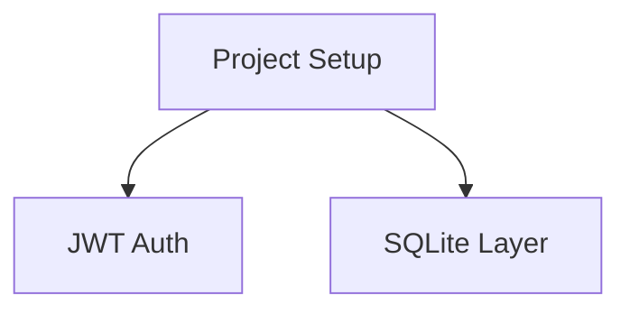

# Cruise-Control Planner Design

**Date**: 2026-02-01
**Status**: Approved
**Phase**: 5 of cruise-control implementation

## Overview

The Planner orchestrates plan generation using spawn-team ping-pong mode with phased reviews, producing beads issues as source of truth and a markdown plan as derived view.

## Data Flow

```
User Prompt
    ↓
┌─────────────────────────────────────────────────┐
│  Spawn-Team Ping-Pong (5 iterations default)    │
│                                                 │
│  Iter 1: Primary drafts → Security review       │
│  Iter 2: Primary refines → Feasibility review   │
│  Iter 3: Primary refines → Granularity review   │
│  Iter 4: Primary refines → Dependency review    │
│  Iter 5: Primary refines → General polish       │
└─────────────────────────────────────────────────┘
    ↓
JSON Plan Output
    ↓
┌─────────────────┐
│ Validation      │
│ - Parse JSON    │
│ - Check cycles  │
│ - Check fields  │
└─────────────────┘
    ↓
┌─────────────────┐     ┌─────────────────┐
│ Write Beads     │ ──→ │ Generate MD     │
│ .beads/CRUISE-* │     │ plan.md         │
└─────────────────┘     └─────────────────┘
    ↓
Create PR (beads + plan.md + graph)
    ↓
Poll for Approval (using ApprovalPoller)
    ↓
PlanResult { success, iterations, task_count, pr_url, ... }
```

## Review Phases

Each ping-pong iteration has a specific focus:

| Iteration | Phase | Focus |
|-----------|-------|-------|
| 1 | Security | Auth, secrets, injection, input validation |
| 2 | Technical Feasibility | Tech stack appropriateness, alternatives |
| 3 | Task Granularity | Right-sizing for parallelization |
| 4 | Dependency Completeness | Missing links, parallelization opportunities |
| 5+ | General Polish | Open-ended refinement |

Phase progression is automatic (one iteration per focused phase).

## Output Format

Primary LLM outputs structured JSON:

```json
{
  "title": "SQLite GUI with JWT Auth",
  "overview": "Build a SQLite GUI interface...",
  "tasks": [
    {
      "id": "CRUISE-001",
      "subject": "Set up Rust project",
      "description": "Create initial project structure...",
      "blocked_by": [],
      "component": "infrastructure",
      "complexity": "low",
      "acceptance_criteria": [
        "Cargo.toml with dependencies",
        "Basic main.rs"
      ]
    }
  ],
  "risks": [
    "JWT key management security",
    "SQLite concurrent access"
  ]
}
```

## Persistence

### Beads Issues (Source of Truth)

Each `CruiseTask` becomes `.beads/CRUISE-XXX.md`:

```markdown
---
id: CRUISE-001
subject: Implement JWT authentication module
status: pending
blockedBy:
  - CRUISE-000
component: auth
complexity: medium
---

# Implement JWT authentication module

Create JWT auth with local CA and private key generation.

## Acceptance Criteria

- [ ] Generate CA and private key on startup
- [ ] JWT token generation endpoint
- [ ] JWT token validation middleware
```

### Generated Markdown (Derived View)

`docs/plans/{date}-{slug}-plan.md`:

```markdown
# {title}

## Overview
{overview}

## Dependency Graph


## Tasks
...

## Parallel Execution Groups
- Group 1: CRUISE-001
- Group 2: CRUISE-002, CRUISE-003 (parallel)

## Risk Areas
{risks}
```

## PR Creation

### PR Files
- `.beads/CRUISE-*.md` - All task issues
- `docs/plans/{date}-{slug}-plan.md` - Generated plan document

### PR Body Format

```markdown
## Summary

{2-3 sentence overview}

<details>
<summary>Original Prompt</summary>

{user_prompt}

</details>

## Tasks ({count})

| ID | Subject | Component | Complexity | Dependencies |
|----|---------|-----------|------------|--------------|
| CRUISE-001 | Project Setup | infrastructure | low | - |
| CRUISE-002 | JWT Auth | auth | medium | CRUISE-001 |

## Dependency Graph

```
CRUISE-001 (Project Setup)
├── CRUISE-002 (JWT Auth)
│   └── CRUISE-004 (API Endpoints)
└── CRUISE-003 (SQLite Layer)
    └── CRUISE-004 (API Endpoints)
```

## Parallel Execution

- **Wave 1**: CRUISE-001
- **Wave 2**: CRUISE-002, CRUISE-003 *(parallel)*

## Planning Stats

- Iterations: {n}
- Review phases: Security ✓, Feasibility ✓, Granularity ✓, Dependencies ✓
```

## Error Handling

Fail-fast approach:

| Error | Detection | Message |
|-------|-----------|---------|
| Invalid JSON | `serde_json::from_str` fails | "Failed to parse plan JSON: {error}" |
| Cycle detected | `CruisePlan::has_cycle()` | "Dependency cycle: A → B → C → A" |
| Missing fields | Validation after parse | "Task CRUISE-002 missing: subject" |
| Empty plan | `tasks.is_empty()` | "Plan produced no tasks" |
| Invalid ID | ID validation | "Task ID must use CRUISE-XXX format" |

## API

```rust
pub struct Planner {
    config: PlanningConfig,
    approval_poller: ApprovalPoller,
}

impl Planner {
    pub fn new(config: PlanningConfig) -> Self;

    /// Run the full planning phase
    pub async fn plan(&self, prompt: &str) -> Result<PlanResult>;

    /// Run planning without PR creation (for testing)
    pub async fn plan_dry_run(&self, prompt: &str) -> Result<CruisePlan>;
}
```

### Internal Functions

- `build_primary_prompt(prompt, iteration)` - Build prompt for primary LLM
- `build_review_prompt(plan_json, phase)` - Build phase-specific review prompt
- `parse_plan_json(output)` - Extract and parse JSON from LLM output
- `validate_plan(plan)` - Check cycles, required fields, ID format
- `plan_to_beads(plan, dir)` - Write CruisePlan as beads issues
- `beads_to_markdown(dir)` - Generate plan.md from beads
- `create_plan_pr(plan, markdown)` - Create GitHub PR

## New Files

- `core/src/cruise/planner.rs` - Main Planner struct and orchestration
- `core/src/cruise/prompts.rs` - Prompt builders for primary/reviewer

## Dependencies

- Existing spawn-team infrastructure (ping-pong mode)
- Existing `ApprovalPoller` from Phase 2
- Existing `CruisePlan`, `CruiseTask` types from Phase 1

## Test Strategy

- Unit tests for JSON parsing and validation
- Unit tests for cycle detection edge cases
- Unit tests for beads writing and markdown generation
- Unit tests for prompt builders
- Integration test with mock LLM responses
