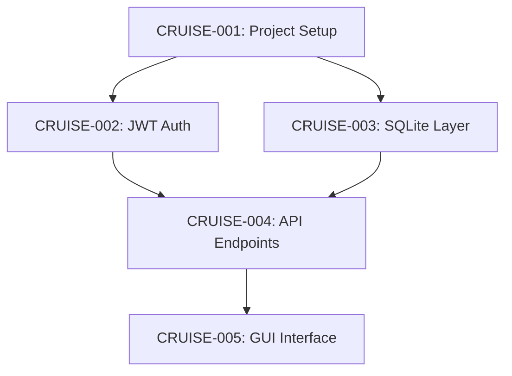

# SQLite GUI with JWT Authentication - Implementation Plan

## Overview

Build a SQLite GUI interface in Rust with JWT authentication using locally generated CA and private key.

## Dependency Graph

## Tasks

### CRUISE-001: Set up Rust project with dependencies
- Component: infrastructure
- Complexity: low
- Dependencies: none

### CRUISE-002: Implement JWT authentication module
- Component: auth
- Complexity: medium
- Dependencies: CRUISE-001

### CRUISE-003: Create SQLite database layer
- Component: database
- Complexity: medium
- Dependencies: CRUISE-001

## Parallel Execution Groups

- Group 1: CRUISE-001 (setup)
- Group 2: CRUISE-002, CRUISE-003 (can run in parallel)
- Group 3: Remaining tasks

## Risk Areas

- JWT key management security
- SQLite concurrent access
